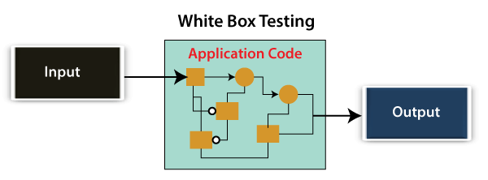
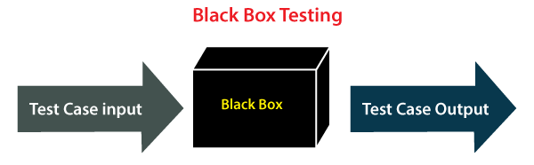
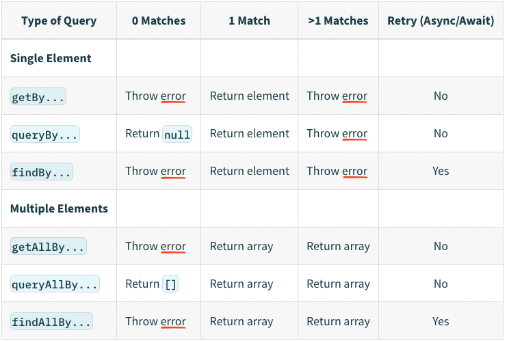

# Getting Started with Create React App

This project was bootstrapped with [Create React App](https://github.com/facebook/create-react-app).

## Lessons

### Lesson 2
Why test?
- Catch bugs in the updated code
  - Increases your confidence in the app
- Speeds up QA time
- Can serve as documentation

### Lesson 3
#### Types of tests
[source](https://www.javatpoint.com/types-of-software-testing)


##### Classification of Manual Testing
- **White Box Testing**
- **Black Box Testing**
- **Grey Box Testing**

###### 1. White Box Testing

What + How?
- The developer will **inspect every line of code**

When?
- before handing it over to the testing team or the concerned test engineers.

Why?
- Emphasize the **flow of inputs and outputs** over the software and enhance the security of an application.

###### 2. Black Box Testing

What + How?
- In this testing, the test engineer will analyze the software against requirements, identify the defects or bug, and sends it back to the development team.

Why?
- To check the functionality of an application as per the customer requirement. The source code is not visible in this testing; that's why it is known as black-box testing.

###### 2.1. Functional (Component) Testing
What?
- The test engineer will check all the components systematically against requirement specifications is known as functional testing.

How?
- All the components are tested by giving the value, defining the output, and validating the actual output with the expected value.

Different types of functional testing:
- **Unit Testing**
- **Integration Testing**
- **System Testing**

###### 2.1.1. Unit Testing
What?
- A unit is _usually_ defined as **a single testable function/component of a software/app**

What isn't?
- dealing with the env or exyeternal systems to the codebase (e.g., database)

When?
- Run them automatically (i.e., attach tests to `git commit` hook w/ Husky)
- Before starting to code the component (TDD)
- A bug occurs, before fixing bugs
- Checking for security vulnerabilities

How?
- Test a single function
- Follow one AAA for each unit test
  - **Arrange**: Set the input for a set of variables and the output of these variables after going through a function 
  - **Act**: Invoke the test and store its result
  - **Assert**: Check if "act step" is correct
- Keep them short (a few lines)
- Test edge cases
  - There are tools to help with code coverage
  - Don't aim for 100% test coverage
- Test both positive/expected and negative/unexpected scenarios
- Keep them stateless: Tests shouldn't change anything outside their scope (i.e., change variables in other tests)
  - Mock real(ish) data in the test scope
- Write deterministic (i.e., repeatable) tests: it should pass or fail. It should provide the same output for the same input all the time (e.g., the time of day shouldn't affect the day). It shouldn't have random input (unless the function which is tested is for that purpose)
- Use descriptive (usually long) names
- Use "precise assertions" that the testing library/framework offers
E.g.:

option 1:
```js
expect(result === expected).toBeTruthy();
// it just fails
```
option 2:
```js
expect(received).toBeTruthy()
Received: false
```
option 3:
```js
expect(received).toBe(expected); // Object.is equality

Expected: "John Doe"
Received: "JohnDoe"
```
- Ensure compliance with industry standards (e.g., HIPAA or PCI-DSS)


###### 2.1.2. Integration Testing
What + How?
- The test engineer will test **the data flow between dependent modules** or interface between two features/components is called integration testing.

Types of Integration Testing

- Incremental Testing: Whenever there is a clear relationship between modules
- Non-Incremental Testing: Whenever the data flow is complex and very difficult to classify a parent and a child

###### 2.1.3. System (End-to-End) Testing
What + How?
- The test environment is parallel to the production environment. The test engineer will undergo each attribute of the software and test if the end feature works according to the business requirement. 

###### 2.2 Non-function testing
Why?
- It provides detailed information on software product performance and used technologies.
- Help us minimize the risk of production and related costs of the software.

Types of Non-functional Testing

- **2.2.1 Performance Testing**
  - **Load testing**: Apply some load on the particulat app to check the apps performance. Helps us detect bottlenecks
  - **Stress testing**: Analyse the user-friendliness and robustness of the software beyond the common functional limits. 
  - **Scalability testing**: Analyse the apps performance by enhancing or reducing the load in particular balances is known as scalability testing.
  - **Stability testing**: Evaluate the app's performance by applying the load for a precise time.
- **2.2.2. Usability Testing**: Analyse the user-friendliness of an application and detect the bugs in the software's end-user interface.
- **2.2.3. Compatibility Testing**: Here, software means we can test the application on the different operating systems and other browsers, and hardware means we can test the application on different sizes.

###### 3. Grey Box Testing
What?
- If a single-person team done both white box and black-box testing, it is considered grey box testing.

### Lesson 4
Common structure of a test, the **test block** (what we are testing, the body of the test code)
- render a component that we are going to test
- find elements we want to interact with *(arrange)*
- interact with those elements *(act)*
- assert that the results are as expected *(assert)*

```js
test('renders learn react link', () => {                  // description, body
  render(<App />);                                        // body, render the component
  const linkElement = screen.getByText(/learn react/i);   // body, find elements
  expect(linkElement).toBeInTheDocument();                // body, assert that the results are as expected
});
```

### Lesson 5 
#### Query methods


---

## Available Scripts

In the project directory, you can run:

### `yarn start`

Runs the app in the development mode.\
Open [http://localhost:3000](http://localhost:3000) to view it in the browser.

The page will reload if you make edits.\
You will also see any lint errors in the console.

### `yarn test`

Launches the test runner in the interactive watch mode.\
See the section about [running tests](https://facebook.github.io/create-react-app/docs/running-tests) for more information.

### `yarn build`

Builds the app for production to the `build` folder.\
It correctly bundles React in production mode and optimizes the build for the best performance.

The build is minified and the filenames include the hashes.\
Your app is ready to be deployed!

See the section about [deployment](https://facebook.github.io/create-react-app/docs/deployment) for more information.

### `yarn eject`

**Note: this is a one-way operation. Once you `eject`, you can’t go back!**

If you aren’t satisfied with the build tool and configuration choices, you can `eject` at any time. This command will remove the single build dependency from your project.

Instead, it will copy all the configuration files and the transitive dependencies (webpack, Babel, ESLint, etc) right into your project so you have full control over them. All of the commands except `eject` will still work, but they will point to the copied scripts so you can tweak them. At this point you’re on your own.

You don’t have to ever use `eject`. The curated feature set is suitable for small and middle deployments, and you shouldn’t feel obligated to use this feature. However we understand that this tool wouldn’t be useful if you couldn’t customize it when you are ready for it.

## Learn More

You can learn more in the [Create React App documentation](https://facebook.github.io/create-react-app/docs/getting-started).

To learn React, check out the [React documentation](https://reactjs.org/).

### Code Splitting

This section has moved here: [https://facebook.github.io/create-react-app/docs/code-splitting](https://facebook.github.io/create-react-app/docs/code-splitting)

### Analyzing the Bundle Size

This section has moved here: [https://facebook.github.io/create-react-app/docs/analyzing-the-bundle-size](https://facebook.github.io/create-react-app/docs/analyzing-the-bundle-size)

### Making a Progressive Web App

This section has moved here: [https://facebook.github.io/create-react-app/docs/making-a-progressive-web-app](https://facebook.github.io/create-react-app/docs/making-a-progressive-web-app)

### Advanced Configuration

This section has moved here: [https://facebook.github.io/create-react-app/docs/advanced-configuration](https://facebook.github.io/create-react-app/docs/advanced-configuration)

### Deployment

This section has moved here: [https://facebook.github.io/create-react-app/docs/deployment](https://facebook.github.io/create-react-app/docs/deployment)

### `yarn build` fails to minify

This section has moved here: [https://facebook.github.io/create-react-app/docs/troubleshooting#npm-run-build-fails-to-minify](https://facebook.github.io/create-react-app/docs/troubleshooting#npm-run-build-fails-to-minify)
